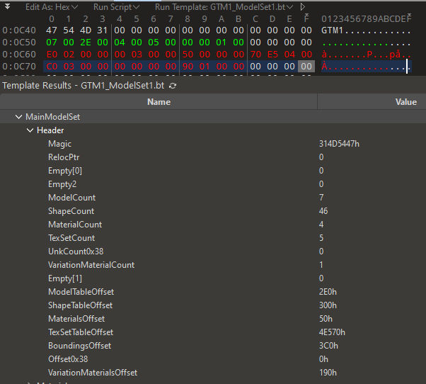
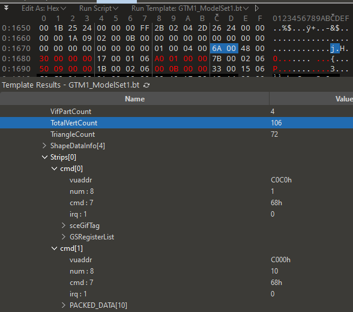
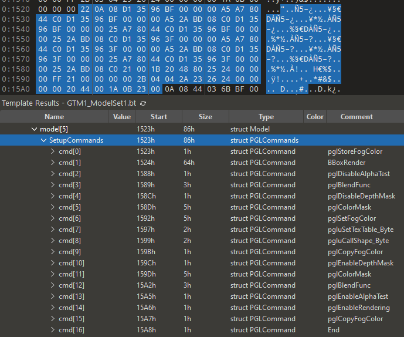
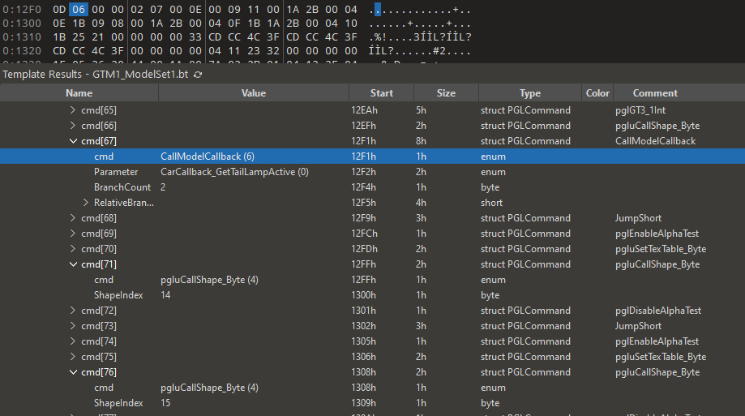
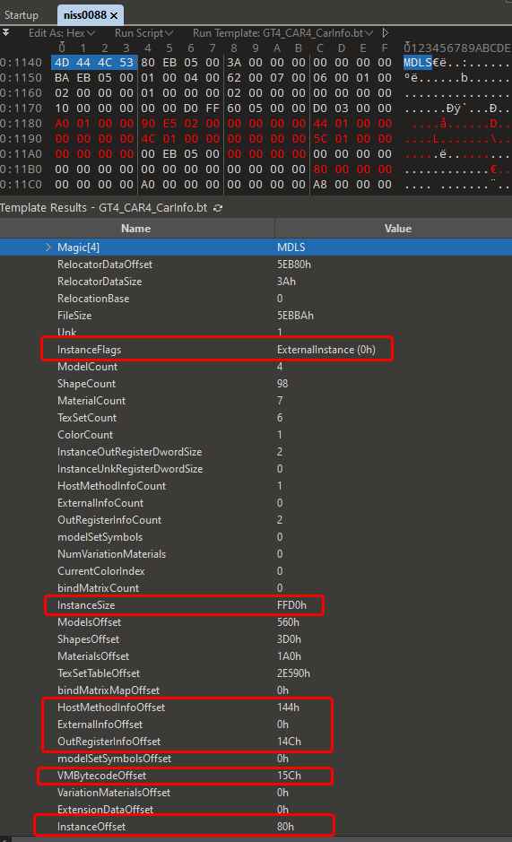
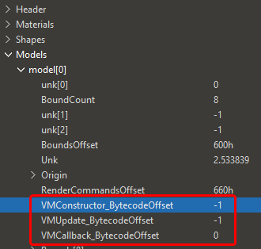
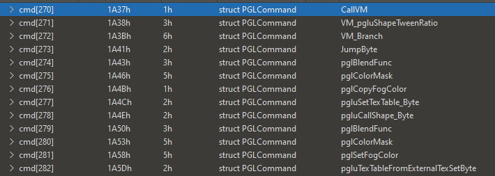

# An Inside Look at a Structured & Flexible Model Format

With custom models upon us, now feels the perfect time to showcase an impressive model format developed by Polyphony Digital for the _Gran Turismo_ series. This post focusses on the implementation used in the PlayStation 2 era of _GT_ titles—however the core concepts would continue to be used across successive games and console generations.

<!-- more -->

## Polyphony Digital's Mindset
But before that, a refresher on Polyphony's *development process* in general - most of their technologies are created [in-house](https://en.wikipedia.org/wiki/In-house_software) - meaning that they normally build their own tools to achieve their goals. Be it being [Adhoc](../../concepts/adhoc/adhoc.md), [SpecDB](../../concepts/specdb.md), this mindset applies nearly to the entirety of the development pipeline.

However creating a custom software implementation doesn’t mean being constrained to limited use cases or the overhead of familiarisation—in fact it can be the complete opposite!

## Enter PDI-GL

_PDI-GL_, or _Polyphony Digital Inc. – Graphics Library_, is PDI’s graphics rendering framework designed for accessibility and drawing inspiration directly from OpenGL [OpenGL](https://en.wikipedia.org/wiki/OpenGL). PDI-GL empowers any developer with a basic understanding of OpenGL to easily begin console development—a huge productivity boost considering the notorious difficulty of working with the PS2[^2] and PS3[^3].

The library abstracts away the complexities of a console’s rendering through of an intuitive set of functions. But what does it mean in practice? Well, consider this basic OpenGL 2.0 example which would rotate a cube around the X axis:

=== "C++ (OpenGL)"

    ``` { .yaml .annotate }
    glPushMatrix(); # (1)!
      glRotate(45.0, 1.0, 0.0, 0.0); # (2)!
      drawCube();
    glPopMatrix(); # (3)!
    ```

    1. [glPushMatrix](https://registry.khronos.org/OpenGL-Refpages/gl2.1/xhtml/glPushMatrix.xml) documentation
    2. [glRotate](https://registry.khronos.org/OpenGL-Refpages/gl2.1/xhtml/glRotate.xml) documentation
    3. [glPopMatrix](https://registry.khronos.org/OpenGL-Refpages/gl2.1/xhtml/glPushMatrix.xml) documentation

=== "C++ (PDI-GL)"

    ```cpp
    pglPushMatrix();
      pglRotate(45.0, 1.0, 0.0, 0.0);
      drawCube();
    pglPopMatrix();
    ```

Observe that the only change was the addition of a `p` prefix (which self-evidently stands for _Polyphony_). The PDI-GL functions match nearly every original OpenGL function! This process makes it trivial for developers to _port_ graphics between games regardless of platform implementation.

---

## Model Sets

_Model Set_ is the name of the file format which contains renderable models. First introduced in 1999 with the concept title and demo _Gran Turismo 2000_, model set has seen continued use right through to the latest release _Gran Turismo 7_ (2022). There are six known revisions:

| Revision | Name | |
|-|-|-|
| `GTM0` | ModelSet0 | _GT2000_ |
| `GTM1` | ModelSet1 | _GT3_, _GTC_ |
| `MDLS` | ModelSet2 | _GT4_, _TT_ |
| `MDL3`, `3LDM` | ModelSet3 | _GT_ (PSP), _GT5_, _GT6_ |
| `4LDM` | ModelSet4 | _GT Sport_, _GT7_ (PS4) |
| `5LDM` | ModelSet5 | _GT7_ (PS5) |

!!! note
    Each revision can also be versioned on their own, this is the case for ModelSet3 & above. But in general, revisions implement more structures or features while retaining the same underlying concepts.

### Header

When new model files are open for reading, they are [re-mapped](http://127.0.0.1:8000/gt-modding-hub/formats/abstract/#mapping) - the file itself is the structure that stays in memory and is then used to operate on. There is no *parsing* involved, therefore much faster to process if they are ready to go.

Each model set header follows the same general pattern - a table of counts and a table of offsets, each pointing to a specific distinct component of a model set. 

<figure markdown>
  { width="520" }
  *The ModelSet1/GTM1 Header, viewed through a [010 Editor](https://www.sweetscape.com/010editor/) [template](https://github.com/Nenkai/GT-File-Specifications-Documentation/blob/master/Formats/PS2/GT3/GTM1_ModelSet1.bt).*
</figure>

There are four components that typically make up a model set:

1. **Models**
2. **Shapes** (aka meshes)
3. **Texture Sets** (aka textures)
4. **Materials**

We will be going through shapes and models, as those cover the majority of the model set system.

### Shapes

Shapes are just **meshes** which points to materials and texture to use. Their formats usually map as close to hardware's as possible. In the case of PS2 model sets for instance, vertex buffers are stored in PS2 [VIF commands](https://psi-rockin.github.io/ps2tek/#vifcommands). [VIF](https://psi-rockin.github.io/ps2tek/#vif) allows uploading data to VU1 which in short, processes data and uploads graphics to [GS](https://www.psdevwiki.com/ps2/Graphics_Synthesizer). Having commands stored in data allows flexibility as for how to control VIF.

<figure markdown>
  { width="520" }
  <figcaption>A shape.</figcaption>
</figure>

Most frequently the VIF commands are `UNPACK` commands, which holds packed data (vertex positions, texture coordinates, normals, strip resets & colors) to be transfered to VIF. That data can be packed to take less space (like 3 floats can be reduced into 3 shorts, which saves 6 bytes per vertex!), although this method is mostly only used in GT4.

VIF commands also holds [GIFtag](https://psi-rockin.github.io/ps2tek/#giftags), which is the primitive way to communicate with the PS2's [Graphics Synthesizer](https://psi-rockin.github.io/ps2tek/#gs) and instruct it on how to render certain buffers. In most cases, [Triangle Strips](https://en.wikipedia.org/wiki/Triangle_strip) are the primary method of transmitting geometry for rendering to the GS.

Employing data-driven formats which align with the hardware is an effective means of integrating extensive flexibility.

### Models

Models are simply a group of shapes. But models also control *how* to render these shapes. But how? Shouldn't this be part of each Shape? Material? Texture? Or even hardcoded?

Introducing model rendering commands!

<figure markdown>
  { width="520" }
  <figcaption>Look familiar?</figcaption>
</figure>

When a game needs to render a model set's models, it will iterate through all of the models and *interpret* their list of commands which closely maps PDI-GL functions.

The main commands to keep in mind are the `CallShape` commands. These take a shape index, and sends the shape's data to VIF for rendering. Any command before after it merely sets up how to render the shape.

In this example, this model sets up the [boundary box](https://en.wikipedia.org/wiki/Minimum_bounding_box) for rendering, sets up how to render the shape (disabling [alpha test](https://en.wikipedia.org/wiki/Multisample_anti-aliasing#Alpha_testing), setting the [blending function](https://www.khronos.org/opengl/wiki/Blending), disabling [depth mask](https://registry.khronos.org/OpenGL-Refpages/gl4/html/glDepthMask.xhtml)...).

Every command after calling the shape simply resets rendering parameters to their defaults.

As PDI-GL is standardized across games, this makes it easier for developers to convert models from a game to another if the same rendering pipeline is used, for instance: *standard car models in GT5 and GT6*![^1]

#### Callback Commands

Every model runs under different contexts for instance, car models, track models and more. A specific command exists to handle cases where the model needs to be rendered differently depending on context: the callback command.

Consider this example (snippet from GT3's Honda S2000):

<figure markdown>
  { width="800" }
</figure>

A callback is made with parameter `0` - the parameter determines what kind of data to request for. The callback returns a value - generally a boolean (true/false).

In this case, the status of the tail lamps is requested, whether they should be on or off. 

- If they are **off**, `CallShape` is called with shape `14`, and skips over the commands in charge of handling when they are **on** using `JumpShort`. 
- If they are **on**, `CallShape` is called with shape `15`.

{ width="500" }
{ width="500" }

As you can see, these shapes are indeed for a specific purpose - data-driven, conditional selection of shapes to call whether lights are on or off.

---

Here is another example of callbacks being used:
<figure markdown>
<video allowfullscreen="true" controls>
      <source id="mp4" src="../../../../videos/787b_wobbling.mp4" type="video/mp4">
</video>
<figcaption>Notice the wiper wobbling? Or even more subtly the antennas? (credits Xenn)</figcaption>
</figure>

This uses another callback parameter (`1` through `4`) which its result calls a shape and tweens it based on the current aero context (and a bit of randomness). That effectively means that there are up to 4 slots where two are being used here.

Another application is found on mudflaps on certain rally cars, which also tend to wobble!

<figure markdown>
  <iframe width="800" height="500" src="https://www.youtube.com/embed/oeAjDCuXf8c?start=97" title="Gran Turismo 3 Epilogue (LANCIA STRATOS RALLY CAR-COSTA DI AMALFI) by  @GT_Electro" frameborder="0" allow="accelerometer; autoplay; clipboard-write; encrypted-media; gyroscope; picture-in-picture; web-share" allowfullscreen></iframe>
  <figcaption>Fun fact - a callback is missing on the left mudflap of the hidden Lancia Stratos (credits: Gran Turismo Italia)</figcaption>
</figure>

Of course, these callbacks are possible with car models, but parameters aren't necessarily tied to specific numbers, as such courses/tracks can also expose their own callbacks!

### Virtual Machine

!!! warning
    This part is a bit technical!

ModelSet2 introduced with _GT4_ went even further and added a [virtual machine](https://en.wikipedia.org/wiki/Virtual_machine) and scripting language for shape manipulation.

We’ll use the beloved GT-R Pace Car as an example, which features two rotating strobe lights—a rather simple setup:

<figure markdown>
  <iframe width="800" height="500" src="https://www.youtube.com/embed/1_K_m1rF5_o?start=142" title="[#1287] Gran Turismo 4 - Nissan GRAN TURISMO SKYLINE GT-R (PaceCar) &#39;01 PS2 Gameplay HD" frameborder="0" allow="accelerometer; autoplay; clipboard-write; encrypted-media; gyroscope; picture-in-picture; web-share" allowfullscreen></iframe>
  <figcaption>Credits: xTimelessGaming</figcaption>
</figure>

First, let's highlight the important VM related bits within the ModelSet2 header:

<figure markdown>
  { width="300" }
</figure>

1. **Instance Flags** - This is a flag that determines whether the structure/context for the VM instance is part of the model set. If not, it will be allocated aside, away from the model file. The instance is **where the VM registers are stored along with host method callbacks**.
2. **Instance Size** - Size of the instance structure. It is always negated until it has been loaded.
3. **Host Method Infos** - VM registers that the model set requests and game engine *provides*, it may be the current car's *speed*, *engine RPM*, *delta time* & more.
4. **Out Registers** - Registers that the VM *outputs* - think of it as output data after the VM has finished processing.
4. **VM Bytecode** - This is the bytecode/commands for the VM, in one single blob of data for the entire model set.
5. **Instance Offset** - Offset for the instance, if it has been indicated as being part of the model set.

Each model contain VM entrypoints - when to use the VM and where within bytecode they should execute. There are 3 of them:

<figure markdown>
  { width="300" }
</figure>

1. **Constructor** - This is called before the model is processed. Optional if there is nothing to be initialized.
2. **Update** - Called on the game's update loop. Optional if there's nothing to be updated.
3. **Render Function** - Called when the render command interpreter encounters a `CallVM` command.

Here are the render commands specific to the Pace Car's strobe lights.

<figure markdown>
  { width="300" }
</figure>

First, the VM is called. For the sake of this blog post I will not go into details as for how the bytecode translates into each instruction, so here is the pseudocode for this model and optionally the original instructions, interpreted:

=== "Pseudocode"

    ```c
    int result;
    result = (((float)time() / 1000f) + 0.0f) % 1.0f;
    result *= 1.0f;

    out builtin_br0 = (int)result;
    out builtin_tw0 = v1 % 1.0f;
    ```

=== "VM Opcodes"

    ``` { .annotate }
    // int result;
    StackAdvance Advance stack by 1, 1 -> 2, likely making space to 1 variable(s)

    // result = (((float)time() / 1000f) + 0.0f) % 1.0f;
    RegisterEval - push stack index: 3 from HostMethod 0 (time) // Note: time is engine provided, values may not be accurate
    ToFloat
    PushIntConst - stack index:4, value:1148846080 (1000f)
    FloatDivide - 0 / 1000, stack index now 3
    PushIntConst - stack index:4, value:0 (0f)
    FloatAddition - 0 + 0, stack index now 3
    PushIntConst - stack index:4, value:1065353216 (1f)
    FloatModulus - 0 % 1, stack index now 3
    StackVariablePush - set stack index 2 value to last value of stack (index 3), stack index now 2

    // result *= 1.0f;
    StackVariableEval - push value from stack index 2, stack index now 3
    PushIntConst - stack index:4, value:1065353216 (1f)
    FloatMultiply - 0 - 1, stack index now 3
    StackVariablePush - set stack index 2 value to last value of stack (index 3), stack index now 2

    // out builtin_br0 = (int)result;
    StackVariableEval - push value from stack index 2, stack index now 3
    ToInt
    RegisterAssignPop - OutRegister 1 (builtin_br0) 0 (from stack index: 3), stack index now 2

    // out builtin_tw0 = v1 % 1.0f;
    StackVariableEval - push value from stack index 2, stack index now 3
    PushIntConst - stack index:4, value:1065353216 (1f)
    FloatModulus - 0 % 1, stack index now 3
    RegisterAssignPop - OutRegister 0 (builtin_tw0) 0 (from stack index: 3), stack index now 2

    Return
    ```

We can see that the VM returns two registers - `builtin_br0` and `builtin_tw0` (likely meaning `branch` and `tween`). The first is a boolean while the other is a float. These all depend on the current delta time in order to smoothly animate, with `1000f` being the duration in milliseconds.

The following `VM_pgluShapeTweenRatio` uses `builtin_tw0` as the angle for the light, while the next `VM_Branch` uses `builtin_br0` as a way to determine whether to follow a logic branch to render an additional shape.

Obviously there are more operations that can be done using output registers, such as [matrix transformations](https://en.wikipedia.org/wiki/Transformation_matrix) (rotations, translations and more).

---

## Victory Lap

Car models from the *sim-racing* genre are undoubtedly some of the most complicated given their dynamic requirements—and has led to many creative solutions such as what’s been outlined in this very post. An incredibly flexible format feturing scripting and forward-compatibility. With a strong foundation, such formats can evolve—so has ModelSet where later revisions added more render commands (as always, abstracted from the console), VM commands, flexible vertex descriptors and more.

Although output formats must be carefully crafted to simplify generation, *input* formats are equally important; Polyphony is known to also keep old models in standardized formats such as [USD](https://en.wikipedia.org/wiki/Universal_Scene_Description), which is a perfect match for editing data across tools in a non-destructive way.[^4][^5]

Starting this investigation with the very first iterations in _GT2000_ and _GT3_ proved highly beneficial—not only to understand future titles, but also with reverse-engineering and associated development. Creating a model tool for _GT3_ has had the immediate benefit of supporting later games!

[^1]: [GT5 standard cars from E3 2010](https://www.youtube.com/watch?v=QV6rbsa6cWc)
[^2]: [Why PlayStation 2 Games Were Notoriously Difficult to Develop](https://www.denofgeek.com/games/playstation-2-difficult-to-develop-retrospective-legacy/)
[^3]: [Gran Turismo maker calls PlayStation 3 development a “nightmare”](https://arstechnica.com/gaming/2016/07/gran-turismo-maker-calls-playstation-3-development-a-nightmare/)
[^4]: [Example of USD usage in the development of “Gran Turismo 7”](https://s3.amazonaws.com/gran-turismo.com/pdi_publications/CEDEC2022_gt7_usd.pdf#page=69) (Page 69)
[^5]: [Implementing USD for Game Development Pipelines: An Interview with Polyphony Digital](https://developer.nvidia.com/blog/implementing-usd-for-game-development-pipelines-an-interview-with-polyphony-digital/)